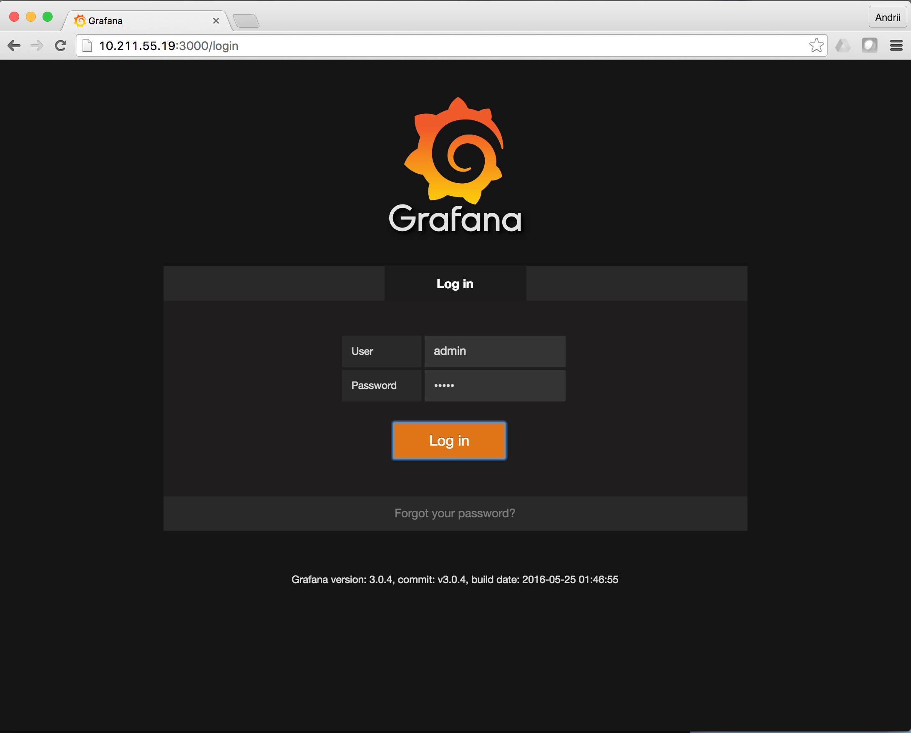
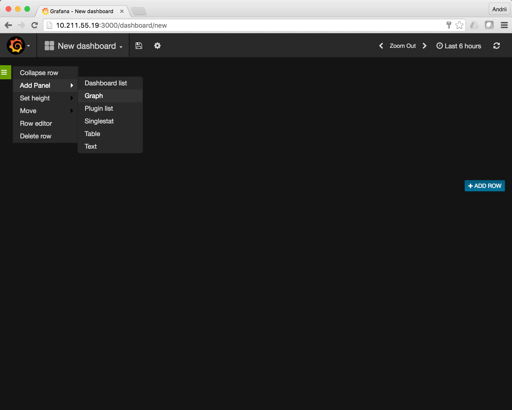

#Graphing __atop__ metrics in grafana/influxdb

Just simple way to create graphics from atop metrics. Now it works for:

- __CPU__ information
- __cpu__ infirmation per core
- __CPL__ CPU load statistic
- __MEM__ Memory usage statistics
- __SWP__ swapping statistics
- __PAG__ paging statistics
- __LVM/MDD/DSK__ disk subsystem statistics
- __NET__ network statistics per interface and upper level

__NOT__ working for process-level statistics:

- "PRG" (general),
- "PRC" (cpu),
- "PRM" (memory),
- "PRD" (disk, only if the kernel-patch has been installed)
- "PRN" (network, only if the kernel-patch has been installed).

## exporting atop metrics

For example, you have atop logs per host:

```
./C1/atop_20160531
./C1/atop_20160601
./C1/atop_20160602
./C1/atop_20160603
./C2/atop_20160531
./C2/atop_20160601
./C2/atop_20160602
./C2/atop_20160603
./C3/atop_20160531
./C3/atop_20160601
./C3/atop_20160602
./C3/atop_20160603
```

To export metrics, please run
```
for i in `find . -type f -name atop\*` ; do
    atop -r $i -P ALL |grep -v '^PR' >$i.ST1;
done
```

This step usualy takes 30-40 min for 10 days logs for 3 server (~30 files)
Result will be looks like:

```
./C1/atop_20160531
./C1/atop_20160531.ST1
./C1/atop_20160601
./C1/atop_20160601.ST1
./C1/atop_20160602
./C1/atop_20160602.ST1
./C1/atop_20160603
./C1/atop_20160603.ST1
./C2/atop_20160531
./C2/atop_20160531.ST1
./C2/atop_20160601
./C2/atop_20160601.ST1
./C2/atop_20160602
./C2/atop_20160602.ST1
./C2/atop_20160603
./C2/atop_20160603.ST1
./C3/atop_20160531
./C3/atop_20160531.ST1
./C3/atop_20160601
./C3/atop_20160601.ST1
./C3/atop_20160602
./C3/atop_20160602.ST1
./C3/atop_20160603
./C3/atop_20160603.ST1
```

where *.ST1 is text file with esported metrics. output looks like:

```
SEP
CPU node-148 1464037202 2016/05/23 14:00:02 980579 100 24 167054722 525625085 340138 1577650406 13623493 4556 10512712 0 0 1398 5
cpu node-148 1464037202 2016/05/23 14:00:02 980579 100 1 167054722 525625085 340138 1577650406 13623493 4556 10512712 0 0 1398 5
MEM node-148 1464382801 2016/05/27 14:00:01 1326179 4096 16467019 608133 3002631 61357 412961 664
```

## Converting atop metrics to file for influxdb

Use `parse.awk` for converting metrics by command:

```
awk -f parse.awk C*/*.ST1  >out4influx.txt
```

This steps usualy takes ~3-5 min for 30 files. Result will be looks like:
```
# DDL
CREATE DATABASE grafana

# DML
# CONTEXT-DATABASE: grafana
CPU,host=node-148 cores=24,sys=170.36,user=536.04,usernice=0.35,idle=1608.90,wait=13.89,irq=0.00,softirq=10.72,steal=0.00,guest=0.00,avgf=1398,avgscal=58 1464037202
cpu,host=node-148,CPUid=0 sys=5.99,user=27.87,usernice=0.02,idle=58.17,wait=0.61,irq=0.00,softirq=2.82,steal=0.00,guest=0.00,avgf=1378,avgscal=57 1464037202
cpu,host=node-148,CPUid=1 sys=5.49,user=28.30,usernice=0.02,idle=61.75,wait=0.65,irq=0.00,softirq=0.71,steal=0.00,guest=0.00,avgf=1349,avgscal=56 1464037202
cpu,host=node-148,CPUid=2 sys=5.36,user=28.03,usernice=0.02,idle=61.72,wait=0.64,irq=0.00,softirq=0.73,steal=0.00,guest=0.00,avgf=1351,avgscal=56 1464037202
cpu,host=node-148,CPUid=3 sys=5.46,user=28.33,usernice=0.02,idle=61.93,wait=0.66,irq=0.00,softirq=0.37,steal=0.00,guest=0.00,avgf=1349,avgscal=56 1464037202
```


## creating docker container with grafana/influxdb

You should have docker installed, configured, up and running (Docker machine is working fine).
```
$ docker -v
Docker version 1.11.2, build b9f10c9
$ docker ps -a
CONTAINER ID        IMAGE               COMMAND             CREATED             STATUS              PORTS               NAMES
$
```

build container:

```
$ cd docker-grafana-influxdb/
andriipetrenko@ap-mbp in ~/GIT/atop-graph/docker-grafana-influxdb on master*
$ ./build
Error response from daemon: No such container: grafana-influxdb_con
Untagged: grafana_influxdb:latest
[... skipped a lot of lines ...]
Step 28 : CMD /usr/bin/supervisord
 ---> Running in 7d9cb0006f47
 ---> dadf676d89a5
Removing intermediate container 7d9cb0006f47
Successfully built dadf676d89a5

$ docker images
REPOSITORY          TAG                 IMAGE ID            CREATED             SIZE
grafana_influxdb    latest              dadf676d89a5        5 minutes ago       411.5 MB
ubuntu              16.04               2fa927b5cdd3        2 weeks ago         122 MB
```

starting container:

```
$ ./start
Error response from daemon: No such container: grafana-influxdb_con
Error response from daemon: No such container: grafana-influxdb_con
f56fc8577efdc97dd8ac1e357e9e2371da836717d0fa016f49103b547726b77f
andriipetrenko@ap-mbp in ~/GIT/atop-graph/docker-grafana-influxdb on master*
$ docker ps -a
CONTAINER ID        IMAGE               COMMAND                  CREATED             STATUS              PORTS                                                                              NAMES
f56fc8577efd        grafana_influxdb    "/usr/bin/supervisord"   2 minutes ago       Up 2 minutes        0.0.0.0:3000->3000/tcp, 0.0.0.0:8083-8084->8083-8084/tcp, 0.0.0.0:8086->8086/tcp   grafana-influxdb_con
andriipetrenko@ap-mbp in ~/GIT/atop-graph/docker-grafana-influxdb on master*
$
```

Details about container can be found [here](./docker-grafana-influxdb/)


## Importing metrics to the influxdb

You should have command line client for influxdb:

```
$ influx --version
InfluxDB shell version: 0.13.0
```

Native version you can found:

- MacOS: brew -- `brew install influsdb`
- Linux: install from packages or download from [oficial site](https://influxdata.com/downloads/)

To imort data to influxdb, run: `influx -import -path=out -precision=s -host <docker_ip>`.

```
$ influx -import -path=out -precision=s -host 10.211.55.19
2016/06/10 16:01:40 Processed 100000 lines.  Time elapsed: 1.903436565s.  Points per second (PPS): 52536
[... some lines skipped ...]
2016/06/10 16:04:43 Processed 5800000 lines.  Time elapsed: 3m4.985149361s.  Points per second (PPS): 31353
2016/06/10 16:04:44 Processed 1 commands
2016/06/10 16:04:44 Processed 5826200 inserts
2016/06/10 16:04:44 Failed 0 inserts
```

Usualy it takes about 3-4 minutes.

## Creating graphics.

Login to grafana: `http://<docker-ip>:3000/`. Login: `admin`, Password: `admin`



Then (G) -> DashBoard -> New then Dashboard -> Add Panel -> Graph



Then creating query. for example: `SELECT "free" FROM "MEM" WHERE "host" = 'node-148'`, then set Y units, set timeframe and we have a graph!

