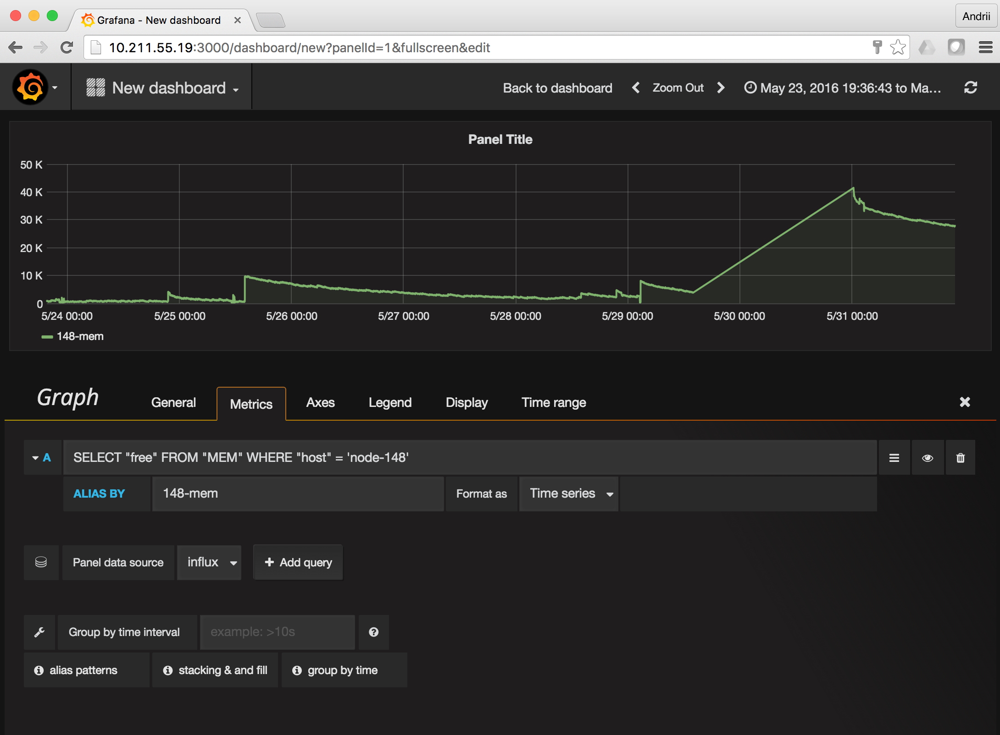

#Graphing __atop__ metrics in grafana/influxdb

Just simple way to create graphics from atop metrics. Now it works for:

- __CPU__ information
- __cpu__ infirmation per core
- __CPL__ CPU load statistic
- __MEM__ Memory usage statistics
- __SWP__ swapping statistics
- __PAG__ paging statistics
- __LVM/MDD/DSK__ disk subsystem statistics
- __NET__ network statistics per interface and upper level

__NOT__ working for process-level statistics:

- "PRG" (general),
- "PRC" (cpu),
- "PRM" (memory),
- "PRD" (disk, only if the kernel-patch has been installed)
- "PRN" (network, only if the kernel-patch has been installed).

## General workflow

###What we have to do:

1. Export necessary metrics from atop binary logs
1. Convert data to the format for export by InfluxDB
1. Push data to the InfluxDB
1. have a graphics in graphana

###How we can do that:

####1. build containers.

Assume you have docker installed. Let's checkout repo

```
# git clone git@github.com:aplsms/atop-graph.git
Cloning into 'atop-graph'...
Warning: Permanently added the RSA host key for IP address '192.30.253.113' to the list of known hosts.
remote: Counting objects: 65, done.
remote: Total 65 (delta 0), reused 0 (delta 0), pack-reused 65
Receiving objects: 100% (65/65), 830.71 KiB | 1.41 MiB/s, done.
Resolving deltas: 100% (19/19), done.
Checking connectivity... done.
```

We are ready to build containers

```
# cd atop-graph
# ./build
Error response from daemon: No such container: atop-convert_con
Can't delete container atop-convert_con
Error response from daemon: No such image: atop-convert:latest
Can't delete image atop-convert
Sending build context to Docker daemon 29.18 kB
Step 1 : FROM ubuntu:16.04
 ---> 0f192147631d

[skipped some lines...]

Step 8 : CMD /convert.sh
 ---> Running in b774434a3f32
 ---> 3378f91923a9
Removing intermediate container b774434a3f32
Successfully built 3378f91923a9
Error response from daemon: No such container: grafana-influxdb_con
Can't delete container grafana-influxdb_con
Untagged: grafana-influxdb:latest
Sending build context to Docker daemon 205.3 kB
Step 1 : FROM ubuntu:16.04
 ---> 0f192147631d

[skipped some lines...]

Step 29 : CMD /usr/bin/supervisord
 ---> Using cache
 ---> 2fa69e2891eb
Successfully built 2fa69e2891eb
```

please ignore "Errors" -- just attempt to remove nonexistant containers

####2. convert the logs

Copy all your logs to ./src directory, and convert it.

```
# find ./src  -type f
./src/D1/dsvtxvcdbng01_atop_20160705
./src/D1/dsvtxvcdbng01_atop_20160706

[Some lines skipped ...]

./src/D2/dsvtxvCkstn02_atop_20160706
./src/D2/dsvtxvCkstn02_atop_20160707
# ./convert
Processing dsvtxvcdbng01_atop_20160705... Done. Result saved to atop-35bb2da4-39dd-4d3e-ab57-30c54822db2b.txt
Processing dsvtxvcdbng01_atop_20160706... Done. Result saved to atop-8d838e8b-8f88-48ea-b595-574d224dd13b.txt

[Some lines skipped ...]

Processing dsvtxvCkstn02_atop_20160706... Done. Result saved to atop-b159eb06-9f4c-4301-8346-45e71bbad002.txt
Processing dsvtxvCkstn02_atop_20160707... Done. Result saved to atop-b9a7f047-5562-408d-b3f1-4b63b142eeab.txt
atop-converter
```

####3. starting grafana and pushing data to InfluxDB

```
# ./start_grafana
Error response from daemon: No such container: grafana-influxdb_con
Error response from daemon: No such container: grafana-influxdb_con
7038475bbb8ad35be5503b33bba06d139310c4064f76935f417765ce2e822022
# ./push
Importing /dst/atop-019c67cf-4572-435c-a693-4178ae4c8af3.txt to influxdb..
2016/07/08 01:01:15 Processed 1 commands
2016/07/08 01:01:15 Processed 38913 inserts
2016/07/08 01:01:15 Failed 0 inserts

[Some lines skipped ...]

Importing /dst/atop-f53bf2ae-b095-4947-b3ad-3082cef521c5.txt to influxdb..
2016/07/08 01:18:50 Processed 1 commands
2016/07/08 01:18:50 Processed 37349 inserts
2016/07/08 01:18:50 Failed 0 inserts
atop-pusher
#
```

####4. Login to grafana, and cgoose proper dashboard and timeframe

In a browser go to  `http://<docker-ip>:3000/`. Login: `admin`, Password: `admin`




PS. Work in progress!